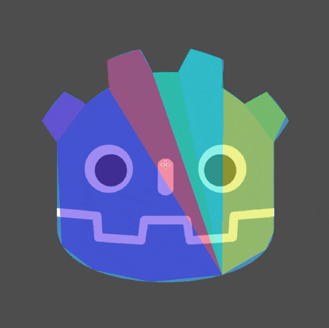

# Godot Sprite Collision Generator

A powerful Godot 4.x editor plugin that automatically generates CollisionPolygon2D shapes from sprite alpha channels with precision control and real-time preview.

## ✨ Features

- 🎯 **Alpha-based Detection**: Automatically traces collision polygons around opaque sprite areas
- 🎚️ **Interactive Precision Control**: Adjustable detail level (1-255) with live preview
- 🔒 **Safety Limits**: Configurable point and polygon limits prevent performance issues
- 🎨 **Live Preview**: Real-time collision shape updates as you adjust parameters
- 📐 **Smart Simplification**: Douglas-Peucker algorithm for optimal polygon reduction
- 🎭 **Convex Hull Option**: Create simplified convex collision shapes
- 📏 **Position Controls**: X/Y offset sliders with exact value input
- 🔄 **Expansion/Contraction**: Photoshop-style edge-normal expansion
- 🎬 **Sprite Sheet Support**: Works with animated sprite frames
- 🎯 **Target Node Selection**: Place collision polygons on any node
- ↩️ **Full Undo/Redo**: Complete editor integration with undo support

## 📦 Installation

### Method 1: Download from GitHub

1. Download the latest release or clone this repository
2. Copy the `addons/sprite_collision_generator` folder to your project's `addons/` directory
3. Open your project in Godot
4. Go to **Project → Project Settings → Plugins**
5. Find "Sprite Collision Generator" and enable it

### Method 2: AssetLib (Coming Soon)

Search for "Sprite Collision Generator" in Godot's AssetLib and click Install.

## 🚀 Quick Start

1. **Select a Sprite2D node** in your scene tree
2. The **"Collision Generator"** dock appears in the top-left
3. Click **"Generate Collision"** to create collision polygons with default settings
4. Fine-tune using the precision slider and other controls

## 📖 Usage Guide

### Basic Generation

1. Select a Sprite2D node in your scene
2. Adjust **Precision** (1-255, default: 128):
   - **1-50**: Simple bounding box or basic shape
   - **50-150**: Balanced detail and performance
   - **150-255**: High detail following pixel edges
3. Click **"Generate Collision"**

### Advanced Controls

#### Precision & Shape
- **Precision Slider**: Controls polygon detail (higher = more accurate)
- **Make Convex**: Creates a convex hull (wraps around shape with no indentations)
- **Max Points**: Safety limit for total points (default: 500, max: 1000)
- **Minimum Part Size**: Filter out small disconnected pieces (pixels)

#### Position & Size
- **X/Y Offset**: Shift collision position (-10 to +10 pixels)
  - Use sliders or type exact values in spinboxes
  - Reset buttons return to 0
- **Expansion**: Grow/shrink collision shape (-10 to +10 pixels)
  - Positive values expand outward
  - Negative values contract inward
  - Uniform growth along edge normals

#### Workflow
- **Live Preview**: Real-time updates as you adjust parameters
- **Target Node**: Specify where collision nodes are created
  - Default: Children of the selected sprite
  - Custom: Select any node in scene tree

## 💡 Tips & Best Practices

- Start with default precision (128) and adjust from there
- Use **Live Preview** to find the optimal precision value
- Lower precision = fewer points, better performance
- Higher precision = more accurate collision, more processing
- Use **Minimum Part Size** to remove small details (eyes, accessories, etc.)
- Enable **Make Convex** for simple objects that don't need concave shapes
- **Sprite sheets work perfectly!** Set the frame you want before generating

### Troubleshooting

If you get "too many points" warning:
- Lower the precision value
- Increase the max points limit
- Increase minimum part size to filter small pieces
- Enable "Make Convex" for simpler shapes

## 🔧 Technical Details

### Algorithms Used
- **Moore Neighborhood Tracing**: Boundary detection
- **Douglas-Peucker**: Polygon simplification
- **Flood Fill**: Region detection
- **Convex Hull**: Geometry2D.convex_hull()
- **Edge Normals**: Photoshop-style expansion

### Performance Considerations
- Default max points: 500 (configurable to 1000)
- Maximum 10 polygon regions processed
- Automatic point counting prevents excessive generation
- Minimum area filter reduces unnecessary polygons

### Coordinate System
- Automatically handles sprite centering
- Respects sprite offset properties
- Proper transformation to target node coordinates

## 📸 Screenshots

## 🤝 Contributing

Contributions are welcome! Please feel free to submit a Pull Request.

## 📄 License

This project is licensed under the MIT License - see the LICENSE file for details.

## 🙏 Credits

Created by [@zwickarr](https://github.com/zwickarr)

## 🐛 Bug Reports & Feature Requests

Please use the [GitHub Issues](https://github.com/zwickarr/godot-sprite-collision-generator/issues) page to report bugs or request features.

## 📚 Changelog

### Version 1.0.0
- Initial release
- Alpha-based collision detection
- Interactive precision control
- Live preview mode
- Convex hull option
- X/Y offset controls with spinboxes
- Expansion/contraction slider
- Target node selection
- Sprite sheet support
- Full undo/redo support
